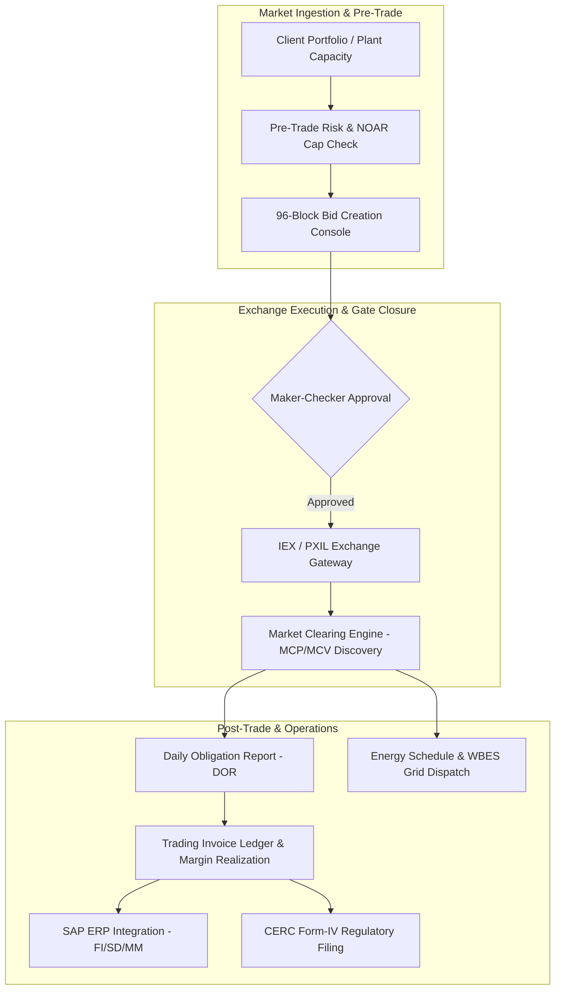
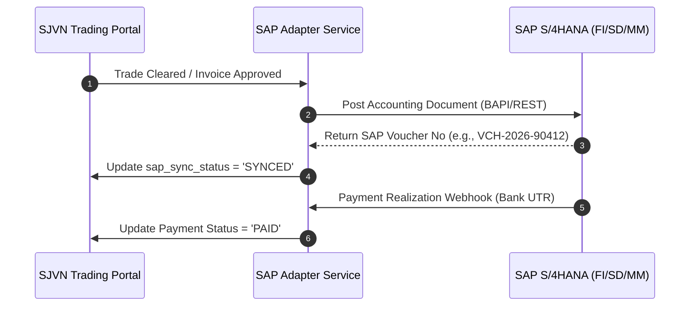

# SJVN Power Trading & Market Operations Platform — Comprehensive System Manual

> **Document Version:** 2.0 (Production Edition)  
> **Target Audience:** Power Traders, Risk Officers, Finance Executives, System Auditors, and IT Teams  
> **Platform Scope:** Day-Ahead Market (DAM), Real-Time Market (RTM), Green DAM (GDAM), Term-Ahead Market (TAM), Bilateral Open Access (STOA), NOAR Registry & Wallet, Energy Scheduling & WBES, Daily Obligation Reports (DOR), Trading Invoicing, REC Hub, CERC Form-IV Regulatory Reporting, and SAP Integration.

---

## Table of Contents
1. [Platform Architecture & Executive Overview](#1-platform-architecture--executive-overview)
2. [User Roles & Security Permissions](#2-user-roles--security-permissions)
3. [Module 1: Trading Command Center (Dashboard & Live Monitor)](#3-module-1-trading-command-center)
4. [Module 2: Power Exchange Engine (DAM / RTM / GDAM Bidding)](#4-module-2-power-exchange-engine)
5. [Module 3: Term-Ahead Market (TAM) Console](#5-module-3-term-ahead-market-tam-console)
6. [Module 4: NOAR Management & Wallet Ledger](#6-module-4-noar-management--wallet-ledger)
7. [Module 5: Bilateral Open Access & Format-D Lifecycle](#7-module-5-bilateral-open-access--format-d-lifecycle)
8. [Module 6: Daily Obligation Report (DOR) & Financial Settlement](#8-module-6-daily-obligation-report-dor--financial-settlement)
9. [Module 7: Energy Scheduling, WBES & DSM Deviation Module](#9-module-7-energy-scheduling-wbes--dsm-deviation-module)
10. [Module 8: Trading Invoicing, Billing Settlement & Debit/Credit Notes](#10-module-8-trading-invoicing-billing-settlement--debitcredit-notes)
11. [Module 9: Renewable Energy Certificate (REC) Operations Hub](#11-module-9-renewable-energy-certificate-rec-operations-hub)
12. [Module 10: CERC Form-IV Regulatory Compliance Reporting](#12-module-10-cerc-form-iv-regulatory-compliance-reporting)
13. [Module 11: Trading Clients & Risk Exposure Portfolio](#13-module-11-trading-clients--risk-exposure-portfolio)
14. [Module 12: SAP ERP Integration & Audit Trail](#14-module-12-sap-erp-integration--audit-trail)

---

## 1. Platform Architecture & Executive Overview

SJVN Power Trading Platform is an enterprise-grade power market execution and settlements suite built to handle high-frequency 15-minute time-block bidding across Indian power exchanges (**IEX, PXIL, HPX**) and bilateral OTC contracts.



### Key Regulatory & Market Standards Implemented
- **CERC Market Rules:** Automated price band validation (Floor: ₹0.00/kWh, Ceiling: ₹10.00/₹12.00/kWh).
- **Time Block Resolution:** Native 96 blocks per day (15-minute intervals), with auto-aggregation to 24 blocks (Hourly) and 50 blocks.
- **Grid Loss Accounting:** EX-BUS (plant busbar) vs Regional Periphery with multi-hop CTU/STU loss derivation.
- **NOAR Compliance:** Format-D CSV generation for Bilateral Open Access.

---

## 2. User Roles & Security Permissions

| Role Identifier | Display Role | Responsibilities & Access Scope |
| :--- | :--- | :--- |
| `TRADING_EXEC` | **Trader (Maker)** | Bid draft creation, Excel 96-block upload, manual block modifications, preliminary validation. |
| `TRADING_HEAD` | **Trading Head (Checker)** | Bid approval, exchange transmission, gate-closure overrides, risk limit updates. |
| `RISK_OFFICER` | **Risk & Exposure Officer** | Client exposure limit setup, NOAR standing clearance monitoring, credit checks. |
| `FINANCE_SETTLEMENT`| **Finance / Settlement** | Daily Obligation verification, invoice approval, margin collection, SAP voucher sync. |
| `COMPLIANCE_AUDITOR`| **Compliance Auditor** | Read-only audit access, CERC Form-IV verification, complete immutable event log review. |

---

## 3. Module 1: Trading Command Center

**Path:** `Frontend -> Trading -> Trading Command Center`  
**Components:** `TradingDashboard.jsx`, `HomeDashboard.jsx`

```
┌────────────────────────────────────────────────────────────────────────────────────────┐
│  TRADING COMMAND CENTER                                       [Download Report (PDF)]  │
├────────────────────────────────────────────────────────────────────────────────────────┤
│  🟢 Exchange Integrations Online (Last Sync: 12:45:00) | IEX: ONLINE | PXIL: ONLINE    │
├────────────────────────────────────────────────────────────────────────────────────────┤
│  [ RECs Traded: 14,250 ] [ Profit: ₹18.4 Lakh ] [ NOAR Balance: ₹8.2 Lakh ] [ Form-IV ]│
├────────────────────────────────────────────────────────────────────────────────────────┤
│  [Real-Time Intraday]          [Daily Settlement]          [Periodic & Trends]         │
└────────────────────────────────────────────────────────────────────────────────────────┘
```

### UI Elements & Functions

#### A. Global Header & Action Buttons
- **`Download Report (PDF)` Button:** Triggers backend PDF rendering engine (`/reports/trading-dashboard/pdf`) generating a signed executive summary of today's market commitments.
- **Exchange Health Banner:** Live ping latency monitor (IEX, PXIL, HPX). Displays Green (`ONLINE`) or Amber/Red (`DEGRADED/OFFLINE`) with millisecond ping tracking.
- **Top KPI Strip:**
  - `RECs Traded`: Total certificates transacted.
  - `Profit from REC`: Net trading revenue earned.
  - `NOAR Wallet Balance`: Current balance with low-balance alert trigger.
  - `CERC Form-IV Status`: Monthly compliance readiness indicator.

#### B. Tab 1: Real-Time Intraday View
- **Open Bids (Unmatched) Card:** Displays active open bid count and aggregate pending quantum in MW.
- **Live Exchange Rates Card:** Real-time ticker of Market Clearing Prices (₹/kWh) per exchange.
- **Client Exposure Limit Utilization Table:**
  - Visual progress bar showing `% of Credit Limit Utilized`.
  - Color trigger: Blue ($\le 90\%$), Red ($> 90\%$ risk threshold).

#### C. Tab 2: Daily Settlement View
- **Summary Cards:** Total Bids, Cleared Bids, Clear Ratio (`Cleared / Total %`), Total Bid MW, Total Cleared MW.
- **Today's P&L Card:** Realized Trading Margin vs Unrealized Floating Margin.
- **Bid Rejection Analysis Table:** Lists bids rejected by exchange with error codes.

#### D. Tab 3: Periodic & Trends
- **Client Profitability Table:** Top clients ranked by cumulative trading margin (YTD).
- **Product Mix Distribution:** Volume split between DAM, GDAM, RTM, and TAM.

---

## 4. Module 2: Power Exchange Engine (DAM / RTM / GDAM Bidding)

**Path:** `Frontend -> Trading -> Bids`  
**Components:** `Bids.jsx`, `DayAheadMarketEngine.jsx`, `GDAMObligationConsole.jsx`

This module is the core transaction desk for day-ahead and real-time market bidding.

```
┌────────────────────────────────────────────────────────────────────────────────────────┐
│  CREATE DAM NEW BID                                 DATE: 03-08-2026 | TIME: 12:59:36  │
├────────────────────────────────────────────────────────────────────────────────────────┤
│  [Asset Verification Card] NOAR: NOAR/2026/089 | NOC: NOC-SJVN-01 | T-GNA Cap: 500 MW │
├────────────────────────────────────────────────────────────────────────────────────────┤
│  LEFT COLUMN (Selectors)                │  RIGHT COLUMN (Radio Groups)                 │
│  - Exchange: [ IEX ▼ ]                  │  - Bid Type: 🟢 Buy  🔴 Sell  ⚪ Both        │
│    Floor: ₹0.00 | Ceiling: ₹12.00/kWh   │  - Bid Structure: 🔘 Single  ⚪ Block        │
│  - Segment: DAM (Day-Ahead)             │  - Bid On: 🔘 EX-BUS  ⚪ Regional Periphery  │
│  - Delivery Date: [ 04/08/2026 📅 ]     │    (Losses borne by buyer)                   │
│  - Portfolio: [ NJHPS 1500MW ▼ ]        │                                              │
├────────────────────────────────────────────────────────────────────────────────────────┤
│  EXCEL FILE UPLOAD ZONE: [24 Blocks] [50 Blocks] [🔘 96 Blocks] | Download formats     │
│  [ 📁 Drag & Drop .xlsx Bid File Here / Browse Files ] -> [ Import File Data ]         │
├────────────────────────────────────────────────────────────────────────────────────────┤
│  MANUAL BLOCK ENTRY (Fallback): [Block 1] [MW: 250.0] [Price: ₹3.85] [+ Add Block]     │
├────────────────────────────────────────────────────────────────────────────────────────┤
│  [Cancel]                                                    [Create Draft Portfolio]  │
└────────────────────────────────────────────────────────────────────────────────────────┘
```

### Complete Field, Button & Calculation Reference

#### 1. Live Clock & Gate Closure Sync
- **`LiveClock` Widget:** Displays synchronous 24-hour exchange server time with heartbeat `● SYNC` indicator.
- **Gate Closure Engine:**
  - DAM Window: Closes strictly at **12:00 PM** on day T-1.
  - RTM Window: Opens and closes every 15 minutes for 1-hour ahead delivery.
  - *Automated Safety:* Platform locks submission button immediately upon gate closure.

#### 2. Asset Verification & NOAR Shield
When a portfolio is selected (e.g. *NJHPS 1500MW*):
- System auto-pulls `NOAR ID`, `Standing Clearance NOC No`, `Approved T-GNA (MW) Capacity`, and `Ramp Rate (MW/min)`.
- If a Generating Station attempts a "BUY" bid without forced outage declaration, system triggers **Clause 23 Compliance Warning**.

#### 3. Core Selectors (Left Panel)
- **Exchange Dropdown (`form.exchange`):** Options `IEX`, `PXIL`, `HPX`.
  - Selecting an exchange dynamically updates price floor/ceiling tags (CERC approved).
- **Segment Tag:** Read-only tag indicating market type (`DAM`, `RTM`, `GDAM`).
- **Delivery Date (`form.delivery_date`):** Date picker constrained to valid market delivery days.
- **Portfolio Select (`form.client_id`):** Selects generating station or trading client.
  - Button **`View Profile`**: Opens client KYC, bank guarantee, and limit status modal.

#### 4. Execution Parameters (Right Panel)
- **Bid Type Radio (`form.type`):**
  - `🟢 Buy` (Green): Power purchase by Discom / Open Access consumer.
  - `🔴 Sell` (Red): Power injection by generator. Auto-selected for generation plants.
  - `Both`: Dual bidding for battery storage / pumped hydro assets.
- **Bid Structure Radio (`form.structure`):**
  - `Single`: Independent price-quantum curve for each 15-minute block.
  - `Block`: All-or-none block execution across designated time intervals.
- **Bid On Radio (`form.bid_on`):**
  - `EX-BUS`: Plant Busbar terminal (Injection losses borne by buyer).
  - `Regional Periphery`: Grid entry point (CTU/STU transmission loss adjusted).

#### 5. Quantum & Price Ingestion Engines

##### A. Excel Bulk Upload Flow
1. **Granularity Selector:** Radio buttons `24 Blocks` (1-hr), `50 Blocks`, `96 Blocks` (15-min).
2. **`Download formats` Links:** Generates blank standardized `.xlsx` templates containing pre-filled `Time Block`, `From Time`, `To Time`, `Quantum (MW)`, and `Price (₹/kWh)`.
3. **Dropzone:** Accepts `.xlsx` and `.csv` files.
4. **`Import File Data` Button:** Runs client-side parsing and validates:
   - Non-numeric or negative values.
   - Price exceeding CERC ceiling (₹12/unit).
   - Quantum exceeding T-GNA approved capacity.
   - Displays row-by-row error preview table before saving.

##### B. Manual Block Entry Table
- Fields: `Time Block` (1 to 96), `Quantum (MW)`, `Price (₹/unit)`.
- Button **`+ Add Block`**: Adds incremental time slot.
- Button **`Copy to All Blocks`**: Broadcasts single rate/MW across all 96 blocks.

#### 6. Submission & Lifecycle Action Buttons
- **`Create Draft Portfolio` Button:** Saves the bid in `DRAFT` status in DB (`bids` & `bid_blocks` tables).
- **`Approve Bid` Button (Checker Role):** Verifies risk margin and changes status to `APPROVED`.
- **`Submit to Exchange` Button:** Transmits bid payload to exchange gateway API/file drop. Changes status to `SUBMITTED` and registers `exchange_receipt_ref`.
- **`Sync Market Result` Button:** Post 14:00 PM, fetches cleared volume and MCP. Transitions blocks to `CLEARED`, `PARTIALLY_CLEARED`, or `UNCLEARED`.

---

## 5. Module 3: Term-Ahead Market (TAM) Console

**Path:** `Frontend -> Trading -> TAM Management`  
**Components:** `TAMManagement.jsx`, `TAMObligationDetailsModal.jsx`

Manages forward contracts traded on exchanges for delivery over Intra-Day, Day-Ahead Contingency (DAC), Daily, Weekly, and Monthly horizons.

### Features & Workflow
- **Contracts Catalog:** Intra-day, Daily, Weekly, Any-Day, Monthly contracts.
- **Matching & Allocation:** Bid submission with continuous matching engine.
- **Obligation Details Modal:** Displays awarded contract schedule, financial margin, CTU booking reference, and delivery milestones.

---

## 6. Module 4: NOAR Management & Wallet Ledger

**Path:** `Frontend -> Trading -> NOAR Registry / NOAR Wallet`  
**Components:** `NOARRegistry.jsx`, `NOARWallet.jsx`

Manages the National Open Access Registry standing clearances and financial wallet for open-access application/transmission charges.

```
┌────────────────────────────────────────────────────────────────────────────────────────┐
│  NOAR WALLET & REGISTRY                                       [+ Add Recharge / Txn]   │
├────────────────────────────────────────────────────────────────────────────────────────┤
│  [ Current Balance: ₹8,24,500 ] [ Total Charges: ₹41,20,000 ] [ Total Recharges: ₹49.4L ]│
├────────────────────────────────────────────────────────────────────────────────────────┤
│  TRANSACTION LEDGER (Chronological Balance Recalculation)                              │
│  Txn No       | Date       | Category | Type     | Amount (₹)   | Balance After (₹)    │
│  NOAR/00142   | 01-08-2026 | ISTS     | CHARGE   | - ₹1,50,000  | ₹8,24,500            │
│  NOAR/00141   | 28-07-2026 | BANK     | RECHARGE | + ₹5,00,000  | ₹9,74,500            │
└────────────────────────────────────────────────────────────────────────────────────────┘
```

### Key Technical Mechanisms
- **Strict Chronological Balance Engine:** When back-dated charges arrive from Grid-India, the system recalculates the entire ledger running balance (`balance_after`) in strict chronological sequence.
- **Low Balance Alert:** Triggers high-priority visual alert when wallet drops below `₹5,00,000` (threshold for absorbing standard monthly ISTS booking).
- **Categories Supported:** `ISTS`, `RLDC`, `APPLICATION`, `OTHER`.

---

## 7. Module 5: Bilateral Open Access & Format-D Lifecycle

**Path:** `Frontend -> Trading -> Bilateral Deals`  
**Components:** `Bilateral.jsx`, `ScheduleGridModal.jsx`

Manages OTC bilateral power purchase agreements, Short-Term Open Access (STOA), and end-to-end NOAR approval workflow.

### 5-Stage NOAR Lifecycle
```
[1. Not Initiated] ──> [2. Format-D Prepared] ──> [3. Contract Created on NOAR] ──> [4. Submitted to NOAR] ──> [5. Approved by NLDC]
```

### Features & Buttons
- **`+ New Bilateral Deal` Button:** Creates deal with Counterparty, LoI Reference, Contracted MW, Tariff (₹/unit), Injection Loss %, Inter-State Loss %, Drawee Loss %.
- **`Generate Format-D (CSV)` Button:** Exports official 96-block Schedule Document adhering to Grid-India bilateral scheduling format.
- **`View 96-Block Schedule Grid` Modal:** Visual interactive matrix showing scheduled MW block-by-block with color-coded injection heatmaps.
- **SLA Tracker Chip:** Displays turnaround days against statutory limits (`On Track`, `At Risk`, `Overdue`).

---

## 8. Module 6: Daily Obligation Report (DOR) & Financial Settlement

**Path:** `Frontend -> Trading -> Daily Obligation Report`  
**Components:** `DailyObligationReport.jsx`, `BankTransactionsList.jsx`

DOR is the financial settlement sheet generated post-market clearing.

```
┌────────────────────────────────────────────────────────────────────────────────────────┐
│  DAILY OBLIGATION REPORT (DOR)              Date: [03-08-2026] | Portfolio: [NJHPS]    │
├────────────────────────────────────────────────────────────────────────────────────────┤
│  Layout: [🔘 SPLIT (1-48 | 49-96)]  [⚪ SINGLE (1-96)]    [Export PDF]  [Export Excel]  │
├────────────────────────────────────────────────────────────────────────────────────────┤
│  Block 01 (00:00-00:15): Qty: 150.00 MW | Rate: ₹3,850/MWh | Obligation: ₹1,44,375   │
│  Block 36 (08:45-09:00): Qty: 250.00 MW | Rate: [Gold Badge: ₹9,200/MWh] (Peak Cleared)│
├────────────────────────────────────────────────────────────────────────────────────────┤
│  FINANCIAL SETTLEMENT SUMMARY                                                          │
│  - Total Energy Volume Cleared: 4,250.00 MWh                                           │
│  - Gross Energy Amount:         ₹1,82,45,000.00                                        │
│  - Exchange Operating Charges:  - ₹12,500.00                                           │
│  - Trading Margin (SJVN):       + ₹85,000.00 (@ 2 paise/unit)                          │
│  - Net Receivable / Payable:    ₹1,83,17,500.00                                        │
├────────────────────────────────────────────────────────────────────────────────────────┤
│  [Post Accounting Voucher to SAP]                           [Generate Trader Invoice]  │
└────────────────────────────────────────────────────────────────────────────────────────┘
```

### Action Buttons & Visual Badging
- **Split Layout Toggle (`SPLIT` vs `SINGLE`):** Switches between dual-column view (Blocks 1–48 and 49–96 side-by-side for 1080p screens) and continuous table.
- **Gold Price Badge (`renderMcp`):** Blocks clearing at or above **₹8,000/MWh (₹8.00/unit)** render with a bold Gold Badge.
- **Green Injection Indicator:** Cleared generating volume displays in bold green.
- **`Post Accounting Voucher to SAP` Button:** Opens SAP voucher creation modal to transmit FI-GL document.

---

## 9. Module 7: Energy Scheduling, WBES & DSM Deviation Module

**Path:** `Frontend -> Trading -> Energy Scheduling / DSM`  
**Components:** `EnergySchedule.jsx`, `EnergyScheduleArchive.jsx`, `backend/src/routes/deviationSettlements.js`

### Key Functions
- **WBES Live Schedule Sync:** Ingests RLDC WebAccess API schedules (Revision cycles R0 to Final).
- **Deviation Settlement Mechanism (DSM):**
  $$\text{DSM Variance (MWh)} = \text{Actual Metered Generation} - \text{Scheduled Generation}$$
  $$\text{Net DSM Amount} = \text{DSM MWh} \times \text{DSM Grid Frequency Linked Rate}$$
- **Archive Explorer:** Full text and date-filtered historical schedule search with CSV export.

---

## 10. Module 8: Trading Invoicing, Billing Settlement & Debit/Credit Notes

**Path:** `Frontend -> Trading -> Billing & Settlement`  
**Components:** `BillingSettlement.jsx`, `DAMInvoiceLedger.jsx`, `GeneratorBilling.jsx`, `backend/src/routes/notes.js`

```
┌────────────────────────────────────────────────────────────────────────────────────────┐
│  TRADING INVOICE LEDGER                                       [+ Create New Invoice]   │
├────────────────────────────────────────────────────────────────────────────────────────┤
│  Invoice No     | Client       | Month   | Gross Energy | Margin | Net Total | SAP Sync│
│  INV/TRD/2026/01| UPPCL Discom | 2026-07 | ₹4.20 Cr     | ₹2.10L | ₹4.22 Cr  | SYNCED  │
├────────────────────────────────────────────────────────────────────────────────────────┤
│  DEBIT / CREDIT NOTES (True-Up Adjustments)                                            │
│  [+ Issue Debit Note (DN)]                          [+ Issue Credit Note (CN)]         │
│  - DN/2026-07/0001 : + ₹45,000 (Revised Final REA Volume adjustment)                   │
│  - CN/2026-07/0001 : - ₹21,000 (Transmission charges rebate true-up)                   │
└────────────────────────────────────────────────────────────────────────────────────────┘
```

### Workflow Rules
- **Invoice Generation:** Computes Energy Amount + Contracted Trading Margin + Open Access Charges + GST.
- **Debit / Credit Notes Engine:**
  - `DEBIT` Note: Increases net payable (signed delta $+1$).
  - `CREDIT` Note: Reduces net payable (signed delta $-1$).
  - `Cancel Note`: Automatically reverses signed delta from invoice ledger.

---

## 11. Module 9: Renewable Energy Certificate (REC) Operations Hub

**Path:** `Frontend -> Trading -> REC Management`  
**Components:** `RECManagement.jsx`, `CertificateOperationsHub.jsx`

Manages environmental attributes trading conducted on the last Wednesday of each calendar month.

### Features & Analytics
- **Certificate Inventory Ledger:** Tracks Solar RECs, Non-Solar RECs, and Hydro Energy Certificates (HECs).
- **Price Band Boundaries:** Floor Price vs Forbearance Price validation.
- **Profit Tracking:** Automated calculation of realized trading profit from certificate arbitrage.
- **Redemption & Compliance Registry:** Logs certificates surrendered for RPO (Renewable Purchase Obligation) fulfillment.

---

## 12. Module 10: CERC Form-IV Regulatory Compliance Reporting

**Path:** `Frontend -> Trading -> CERC Form-IV`  
**Components:** `CERCFormIV.jsx`, `backend/src/routes/formIv.js`

Generates mandatory monthly regulatory returns under CERC (Procedure, Terms and Conditions for grant of trading licence) Regulations.

```
┌────────────────────────────────────────────────────────────────────────────────────────┐
│  CERC FORM-IV REGULATORY COMPLIANCE                            [+ New Form-IV Period]  │
├────────────────────────────────────────────────────────────────────────────────────────┤
│  Status: [SUBMITTED] | Volume: 42.50 MU | Trading Margin: 2.00 paise/kWh [COMPLIANT]   │
├────────────────────────────────────────────────────────────────────────────────────────┤
│  [Auto-Populate from Trades]                                  [Download Regulatory PDF]│
├────────────────────────────────────────────────────────────────────────────────────────┤
│  Form-IV Line Items Breakdown:                                                         │
│  - Form-IV A: Intra-State Bilateral Transactions                                      │
│  - Form-IV B: Inter-State Bilateral Transactions (via Open Access)                    │
│  - Form-IV E: Power Exchange DAM Trades (Volume, Purchase Rate, Sale Rate, Margin)     │
│  - Form-IV F: Power Exchange RTM Trades                                                │
└────────────────────────────────────────────────────────────────────────────────────────┘
```

### Buttons & Automation
- **`Auto-Populate from Trades` Button:** Scans all cleared DAM, RTM, TAM, and Bilateral trades for the selected month and automatically generates all compliant Form-IV line items.
- **Trading Margin Compliance Checker:**
  - If Trading Margin $\le 7.00\text{ paise/kWh} \implies$ Displays Green `COMPLIANT` badge.
  - If Trading Margin $> 7.00\text{ paise/kWh} \implies$ Displays Red `BREACH` alert.
- **`Download Regulatory PDF` Button:** Produces the official submission-ready CERC regulatory dossier.

---

## 13. Module 11: Trading Clients & Risk Exposure Portfolio

**Path:** `Frontend -> Trading -> Trading Clients`  
**Components:** `TradingClients.jsx`, `TradingClientProfile.jsx`

Maintains the master KYC, banking, and credit profiles of all trading counterparties.

### Field Master & Risk Caps
- **Profile Fields:** Client Legal Name, Short Code, Client Type (`GENERATOR`, `DISCOM`, `OPEN_ACCESS_CONSUMER`, `TRADER`), PAN, GSTIN, Registered Address.
- **Bank & Credit Security:** Bank Guarantee (BG) Amount, Letter of Credit (LC) Amount, Cash Deposit.
- **Daily Exposure Limit (₹):** Maximum allowed un-cleared open position in exchange bidding.
- **Status Toggles:** `ACTIVE`, `SUSPENDED` (Bidding disabled).

---

## 14. Module 12: SAP ERP Integration & Audit Trail

**Path:** `Backend Service Layer & Admin Console`  
**Components:** `backend/src/routes/invoices.js`, `schema.sql`, `auditLogs.js`

### SAP Document Flow


### Audit & Security Architecture
- Every bid edit, rate modification, approval, and exchange dispatch is recorded with:
  - `actor_id`, `actor_name`, `action`, `module`, `entity_type`, `entity_id`, `ip_address`, `timestamp`, and `details (JSON)`.
- Records are immutable and tamper-evident.

---

## Summary of All Operational Buttons

| Button Name | Screen / Location | Function & Effect |
| :--- | :--- | :--- |
| **`Download Report (PDF)`** | Trading Dashboard | Downloads executive summary PDF of trading metrics. |
| **`Create Draft Portfolio`** | Create DAM/RTM Bid Modal | Saves 96-block bid in `DRAFT` status after validation. |
| **`Import File Data`** | Bid Excel Dropzone | Parses 24/50/96-block Excel sheet and populates grid. |
| **`Download formats`** | Bid Excel Dropzone | Downloads blank standard Excel template. |
| **`+ Add Block`** | Manual Bid Entry | Adds individual 15-minute time block. |
| **`Approve Bid`** | Bids Ledger (Checker) | Authorizes draft bid for exchange transmission. |
| **`Submit to Exchange`** | Bids Ledger | Transmits bid to IEX/PXIL gateway before Gate Closure. |
| **`Sync Result`** | Bids Ledger | Fetches MCP/MCV and clears 96-block volume. |
| **`+ Add Recharge / Txn`** | NOAR Wallet | Adds funds or logs open-access debits with auto-balance update. |
| **`Generate Format-D (CSV)`**| Bilateral Deals | Exports official Grid-India bilateral schedule CSV. |
| **`View Schedule Grid`** | Bilateral Deals | Opens interactive 96-block dispatch matrix modal. |
| **`Export DOR (PDF/Excel)`** | Daily Obligation Report | Exports block-wise financial obligation statement. |
| **`Post to SAP`** | DOR / Invoices | Pushes accounting document to SAP ERP. |
| **`Auto-Populate from Trades`**| CERC Form-IV | Derives monthly CERC regulatory line items automatically. |
| **`+ Issue Debit/Credit Note`**| Billing Settlement | Creates post-billing adjustment with automatic invoice balance sync. |

---
*End of Comprehensive System Manual.*
